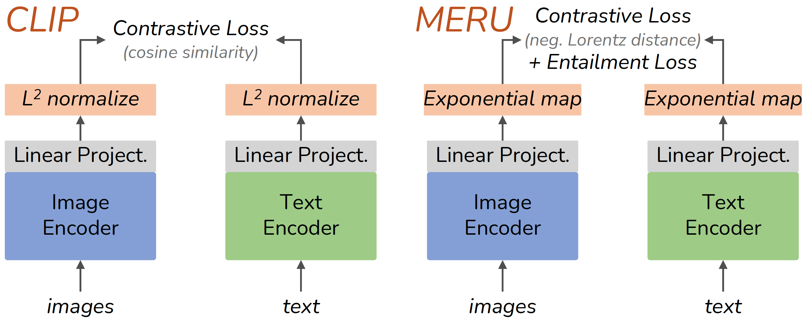

# Accept the Modality Gap: An Exploration in the Hyperbolic Space (CVPR 2024 Highlight) [[`Paper`](https://openaccess.thecvf.com/content/CVPR2024/papers/Ramasinghe_Accept_the_Modality_Gap_An_Exploration_in_the_Hyperbolic_Space_CVPR_2024_paper.pdf)] 
Sameera Ramasinghe, Violetta Shevchenko, Gil Avraham, Ajanthan Thalaiyasingam

Note: This codebase is heavily based on the [MERU](https://github.com/facebookresearch/meru) repo. We thank the MERU authors for their generous contributions.

<!-- <p align="center"></p> -->


## Installation

```
git clone https://github.com/samgregoost/atmg.git
cd atmg
conda create -n atmg python=3.9 --yes
conda activate atmg
```

Install torch and torchvision following the instructions on [pytorch.org](https://pytorch.org).
Then install the remaining dependencies, and this codebase as a dev package:

```
python -m pip install --pre timm
python -m pip install -r requirements.txt
python setup.py develop
```

### Training data

The models are trained using the [RedCaps dataset](https://redcaps.xyz).
Use the [RedCaps downloader tool](https://github.com/redcaps-dataset/redcaps-downloader) and follow the instructions to
[download the dataset](https://github.com/redcaps-dataset/redcaps-downloader#basic-usage-download-official-redcaps-dataset)
and further [organize as TAR files](https://github.com/redcaps-dataset/redcaps-downloader#organizing-the-dataset-as-tar-files).

The dataset is expected relative to the project repository as follows:

```shell
atmg  # project repository.
└── datasets
    └── redcaps
        ├── shard_00000000.tar
        ├── shard_00000001.tar
        └── {any_name}.tar
```

This dataset format is general enough to support training with similar image-text datasets
like Conceptual Captions ([12M](https://arxiv.org/abs/2102.08981), [3M](https://aclanthology.org/P18-1238/)),
if they are structured as TAR files described above.


### Training the models

Train a ViT-small model use the below command:

```bash
python scripts/train.py --config configs/train_atmg_vit_s.py --num-gpus 8 --output-dir ./output
```

To change the other configurations, edit ```configs/train_atmg_vit_l.py```. The VIT-small and VIT-base model configurations are inherited from the VIT-large config file. 

## Pretrained checkpoints

Our trained model checkpoints can be downloaded from the below links.

- Model: [ATMG ViT-base](https://dl.fbaipublicfiles.com/meru/meru_vit_b.pth) and config: [train_atmg_vit_b.py](./configs/train_atmg_vit_b.py)
- Model: [ATMG ViT-small](https://dl.fbaipublicfiles.com/meru/meru_vit_s.pth) and config: [train_atmg_vit_s.py](./configs/train_atmg_vit_s.py)


## Image traversals

<p align="center">
    
</p>

To perform image traversals run the below command

```
python scripts/image_traversals.py --image-path assets/taj_mahal.jpg \
    --checkpoint-path checkpoints/atmg_vit_s.pth --train-config configs/train_atmg_vit_s.py
```

## Evaluate trained models

This codebase supports evaluation on **22 datasets** on three types of tasks.
See the instructions below.

1. **Zero-shot image classification:**

Download and symlink the ImageNet dataset ([Torchvision ImageFolder](https://pytorch.org/vision/main/generated/torchvision.datasets.ImageFolder.html)
style) at `./datasets/eval/imagenet`. The evaluation script will auto-download and cache
all other 19 datasets in `./datasets/eval`.
Run the following command to evaluate ATMG ViT-small on 20 datasets:

```
python scripts/evaluate.py --config configs/eval_zero_shot_classification.py \
    --checkpoint-path checkpoints/atmg_vit_s.pth \
    --train-config configs/train_atmg_vit_s.py
```

2. **Zero-shot image and text retrieval:**

Two datasets are supported, COCO captions and Flickr30k captions. Arrange their files in `./datasets/coco` and `./datasets/flickr30k`.

```
python scripts/evaluate.py --config configs/eval_zero_shot_retrieval.py \
    --checkpoint-path checkpoints/atmg_vit_s.pth \
    --train-config configs/train_atmg_vit_s.py
```

If you find our work useful, please consider citing as below.

```
@inproceedings{ramasinghe2024accept,
  title={Accept the modality gap: An exploration in the hyperbolic space},
  author={Ramasinghe, Sameera and Shevchenko, Violetta and Avraham, Gil and Thalaiyasingam, Ajanthan},
  booktitle={Proceedings of the IEEE/CVF Conference on Computer Vision and Pattern Recognition},
  pages={27263--27272},
  year={2024}
}
```
